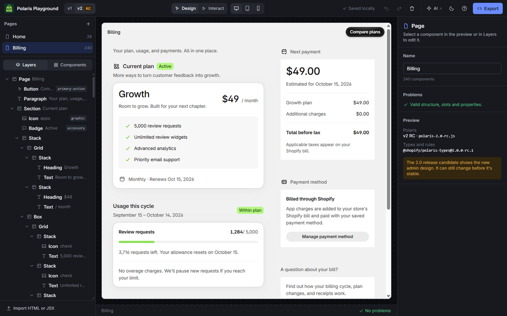

# PlayPolaris

[Open the builder](https://playpolaris.dev/builder) · [Website](https://playpolaris.dev)

Prototype Shopify App Home screens with [Polaris web components](https://shopify.dev/docs/api/app-home/web-components), check them against Polaris's nesting and slot rules, and export HTML or React JSX. The editor runs in the browser. Pages are saved to IndexedDB, with no accounts or backend for saved work.

This is an independent project, not made or endorsed by Shopify.



## Features

- **Live preview with the real runtime.** The canvas is an iframe that loads Shopify's own `polaris-1.js` (v1) or `polaris-2.0-rc.js` (v2 release candidate, the new admin design). Switch versions at any time to compare them.
- **Drag and drop.** Built on [dnd-kit](https://dndkit.com). Drag from the component palette, the layers tree or the preview itself. Drop targets know about slots, row and column layouts, and slot capacity. Invalid drops are refused with the reason.
- **Add between elements.** Hover the gap between two layers, or use the add buttons on a hovered element in the preview, to open a component picker. It only lists components that are allowed at that spot. At the end of a nested group, the pointer's horizontal position picks how deep the new component goes. Clicking an empty container's placeholder adds into it.
- **Validation.** Checks allowed parents, slot contents (for example `primary-action` takes one primary button), property values, duplicate ids, broken `commandFor`/`interestFor` links and accessibility basics. Problems appear in the tree, the inspector and the status bar.
- **Inspector.** Typed controls for every property, generated from the component manifest. It also shows per-value docs, slot placement, and slot and event references.
- **Pages.** Create blank pages or start from templates (Home, Index, Details, Settings, Empty state). You can rename, duplicate and delete pages.
- **Saved components.** Select anything you built and choose "Save as component" to reuse it. Saved components appear first in the palette and the add-here picker; click or drag them into place. They follow the same nesting rules, checked for every root element, so a button saved with its modal only goes where both are allowed. You can rename them, replace their contents with the current selection, or delete them (with undo). Inserted copies are independent snapshots.
- **Export.** HTML (a fragment, or a full document with the Polaris and optional App Bridge script tags) or React JSX/TSX, for one page or all pages (zip).
- **Import.** Paste HTML, or JSX copied from Shopify's docs. Event handlers, scripts and non-Polaris tags are removed.
- **Editing.** Hover any element in the preview or any row in the tree to duplicate or delete it. Undo/redo (typing in a field merges into one step), copy/cut/paste nodes as HTML through the system clipboard, keyboard navigation of the tree, and an interact mode for using the components.
- **Collaborative editing.** Choose **Share → Start shared session** to create a separate shared copy of your pages. Send the room link to edit together. Each browser saves its copy locally, and undo affects that browser's edits. Your personal workspace stays separate.
- **A short tour** for first-time visitors (built on [driver.js](https://driverjs.com), loaded only when it runs). Replay it any time from the Help menu.
- **Light and dark themes** for the builder, following the system by default. The Polaris preview stays in the admin's light theme.
- **Two tabs, one editor.** Open the builder in a second tab and it shows the workspace view-only, mirroring edits live. "Edit here instead" moves editing over after the other tab saves, and closing the editing tab hands editing to a waiting one.
- **AI agents over [WebMCP](https://webmachinelearning.github.io/webmcp/).** 27 tools let an in-browser agent read the catalog, build and edit pages from HTML, find and duplicate components, undo/redo, control and inspect the preview, capture screenshots, validate and export. Calls show up in an activity log; page edits share the editor's undo history.

## Getting started

Use **Node.js 24** (see [`.nvmrc`](.nvmrc)) and **pnpm 10.34.1** (pinned in `package.json`). Install pnpm using its [installation guide](https://pnpm.io/installation), then run these commands from your clone of the repository:

```bash
pnpm install --frozen-lockfile
pnpm dev         # http://localhost:3000 (homepage), /builder (the app)
```

Local development needs no environment variables, Shopify credentials, or Cloudflare account. The preview loads Polaris from Shopify's CDN, so it needs an internet connection.

```bash
pnpm check          # formatting and lint
pnpm typecheck      # TypeScript
pnpm test           # Vitest logic, storage, UI and route tests
pnpm test:watch     # rerun affected tests while editing
pnpm test:coverage  # enforce coverage thresholds; HTML report in coverage/index.html
pnpm build          # Cloudflare Workers build
pnpm preview        # preview the production build locally
```

Deployment uses `pnpm deploy` and requires your own Cloudflare account and Worker configuration in `wrangler.jsonc`.

## Contributing and support

Bug reports, documentation fixes, and focused pull requests are welcome. See [CONTRIBUTING.md](CONTRIBUTING.md) for setup, checks, and what to include in an issue or pull request. Use the repository's issue tracker for questions and feature requests.

### Storage and tabs

The workspace lives in IndexedDB: one row per page and per saved component, plus a settings row that keeps the page order. Saves are debounced and write only the rows whose objects changed, which the immutable editor makes an identity check. A workspace saved by the first release (one big record) is moved over once on load.

Use **Clear local data** (the trash icon in the personal workspace toolbar) to delete its pages, saved components, and workspace settings and start with a blank page. This also clears undo history and updates other personal-workspace tabs. It does not remove cached shared rooms. Export any work you want to keep before confirming.

Only one tab edits at a time, so two tabs can't overwrite each other. The editing tab holds a [Web Lock](https://developer.mozilla.org/docs/Web/API/Web_Locks_API). Other tabs are view-only: the editing tab announces each save over a `BroadcastChannel`, and they show what it stored. They also queue for the lock, so closing the editing tab promotes the next one. "Edit here instead" asks the editing tab to save over the same channel, then takes the lock with `steal`. Browsers without Web Locks just edit.

### Shared rooms

Shared rooms allow simultaneous editing across browsers and tabs. **Share → Copy link** gives anyone with the link editing access. **Leave room** returns to your personal workspace; keep the link to reopen the room's saved local copy. Selection, active page, viewport and saved components stay local to each browser.

[Yjs](https://github.com/yjs/yjs) merges node properties and text. Moves keep node identities; conflicting moves resolve deterministically, and components with broken parent links are recovered at the first page's root. The existing validator reports nesting and slot conflicts. Undo tracks only this browser's user and agent edits.

The Cloudflare Durable Object forwards WebSocket messages and uses hibernation. It never writes documents to server storage. A newcomer must wait for a participant with a saved copy to connect; existing participants can reopen their cached copy and edit during a disconnection. Reconnecting exchanges missing updates. Clearing site data removes that browser's saved rooms, so export important work.

Rooms are limited to 16 connected browsers and 1 MB per synchronization message. The SQLite-backed class in `wrangler.jsonc` works on the Workers Free plan without using its document storage. `pnpm dev` runs the room locally without a Cloudflare account; deploying the existing Worker also deploys the room binding and class migration.

### Homepage and search

`/` is server-rendered: a product page with an FAQ, canonical and Open Graph tags, and one JSON-LD graph (`WebSite`, `WebApplication`, `FAQPage`). `/builder` renders on the client only and is `noindex`, since its server HTML is an empty shell. `/robots.txt` (with explicit allows for AI crawlers), `/sitemap.xml` and [`/llms.txt`](https://playpolaris.dev/llms.txt) are server routes built from `src/site.ts`. All discovery URLs use `https://playpolaris.dev`, including when served from a preview or alternate host. Structured data and `llms.txt` also link to the source repository and MIT License.

For a separately hosted fork, update `SITE.url` and `SITE.repository` in `src/site.ts`, plus the links in `package.json` and this README. Local development works without changes; navigation and app assets use relative URLs.

The builder's code isn't loaded on the homepage. Inter and JetBrains Mono are self-hosted (`src/assets/fonts`, SIL Open Font License), so first paint doesn't wait on a third-party stylesheet.

### WebMCP

The app registers tools with `document.modelContext` (the current draft) and falls back to `navigator.modelContext` (earlier Chromium builds and the MCP-B polyfill). The **AI** button in the toolbar shows whether WebMCP is available and lists recent agent calls.

The tools are `get_workspace`, `list_components`, `get_component`, `get_page`, `create_page`, `open_page`, `rename_page`, `delete_page`, `insert_html`, `set_page_html`, `update_node`, `move_node`, `remove_node`, `select_node`, `list_saved_components`, `save_component`, `validate_page`, `export_code` and `set_polaris_version`.

Additional preview and editing tools:

| Tool                                | Inputs and behavior                                                                                                                                                                                                                       |
| ----------------------------------- | ----------------------------------------------------------------------------------------------------------------------------------------------------------------------------------------------------------------------------------------- |
| `set_preview`                       | `viewport`: `desktop`, `tablet`, or `mobile`; `mode`: `design` or `interact`. Supply either or both.                                                                                                                                      |
| `inspect_preview`                   | Current preview readiness, dimensions, horizontal overflow, and image/font loading. Desktop fills available space; tablet/mobile widths can be constrained by the editor window.                                                          |
| `screenshot_preview`                | Captures the open preview's visible viewport, or a component's rendered bounds with `nodeId`. Waits up to 10 seconds for readiness; preserves selection, mode, and scroll.                                                                |
| `undo` / `redo`                     | One step of shared page history, including user edits. Returns `changed`, `canUndo`, and `canRedo`. Saved components and Polaris version are outside this history.                                                                        |
| `find_nodes`                        | Optional `pageId`, `tag`, `text`, `attrs`, and `limit` (default 50, max 200). Filters combine with AND. Text matches descendant text case-insensitively; attribute strings match exactly, `true` checks presence, `false` checks absence. |
| `duplicate_node` / `duplicate_page` | Copy an `id` / optional `pageId` using the editor's duplication behavior and fresh node ids. Selects/opens the copy.                                                                                                                      |

Screenshot results contain a text metadata block (page name, dimensions, and capture warnings) followed by `{ type: "image", mimeType: "image/png", data: "<base64>" }`. The agent integration must forward the image block or decode it to a PNG file and attach that file to show the screenshot in chat. A text-only bridge will need image forwarding; WebMCP itself does not guarantee inline image display. Screenshots use [SnapDOM](https://github.com/zumerlab/snapdom), loaded only on capture, to rasterize the live preview and its open shadow roots locally. Editor overlays are excluded. Captures are limited to 16 megapixels; check metadata warnings for resources or rendering that needed a fallback. Nothing is uploaded.

## Limits

- The preview needs network access to Shopify's CDN for the Polaris runtime.
- App Bridge APIs (toasts, save bar, resource picker) aren't simulated, because they need the Shopify admin.
- The JSX importer handles literal props (`min={0}`, `disabled={true}`). It doesn't evaluate expressions.

## License

Licensed under the [MIT License](LICENSE). Third-party dependencies and bundled fonts retain their own licenses.
